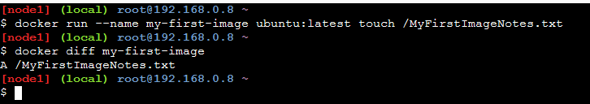
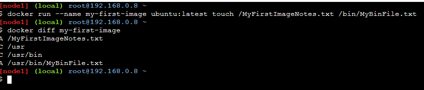

# Docker "diff" command to find the differences between base image and the new image

# Docker "diff" command

A Docker diff command allows to know the difference between a new Docker image and its new image.

Commands are:

``` sh

docker run --name my-first-image ubuntu:latest touch /MyFirstImageNotes.txt

docker diff my-first-image

docker rm my-first-image

```



# docker diff command

Below is antother output of "docker diff" command. C stands for change and A stands for added.

``` sh

docker run --name my-first-image ubuntu:latest touch /MyFirstImageNotes.txt /bin/MyBinFile.txt

docker diff my-first-image

docker rm my-first-image

```


