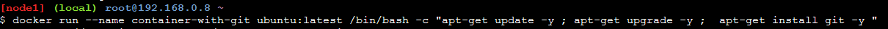
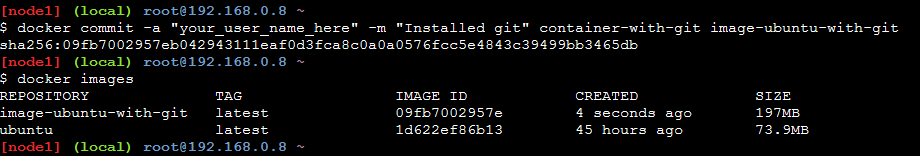

# 01  Docker commands that uses the  "commit" command

## Below docker run command installs git in a container

``` sh

docker run --name container-with-git ubuntu:latest /bin/bash -c \
    "apt-get update -y ; apt-get upgrade -y ;  apt-get install git -y "

```



## docker commit command

Docker command that commits an existing image. Ensure to give appropriate name by replacing the text "your_user_name_here" below

``` sh

docker commit -a "your_user_name_here" -m "Installed git" container-with-git image-ubuntu-with-git

```

