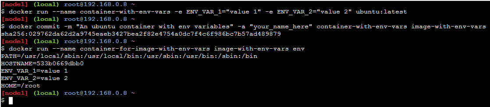

# Docker container environment variables printing

Below commands demonstrate how to print all the enviromental variables in a docker container

``` sh

docker run --name container-with-env-vars -e ENV_VAR_1="value 1" -e ENV_VAR_2="value 2" ubuntu:latest

docker commit -m "An ubuntu container with env variables" -a "your_name_here" container-with-env-vars image-with-env-vars

docker run --name container-for-image-with-env-vars image-with-env-vars env

```

