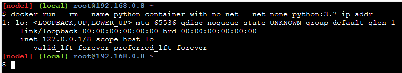
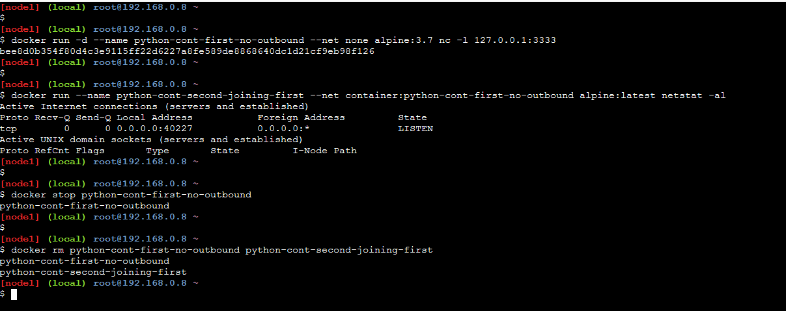
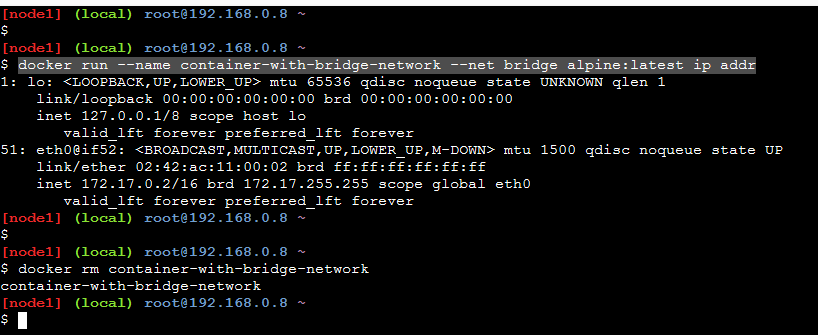

# Docket networking commands and attributes

## Docker container with no outbound access

Below creates a Python container with "--net none", which removes outbound network to the container.

``` sh

docker run --rm --name python-container-with-no-net --net none python:3.7 ip addr

```



## 2 Docker containers joining with --net none

Below creates 2 containers with first one not having outbound network and the 2nd one joining the first

``` sh

# A daemon container (i.e. -d attribute)
docker run -d --name python-cont-first-no-outbound --net none alpine:3.7 nc -l 127.0.0.1:3333

docker run --name python-cont-second-joining-first --net container:python-cont-first-no-outbound alpine:latest netstat -al

docker stop python-cont-first-no-outbound

docker rm python-cont-first-no-outbound python-cont-second-joining-first

```



## Docker container joining bridge network

Below container joins a bridge network using --net bridge attribute

```sh

docker run --name container-with-bridge-network --net bridge alpine:latest ip addr

docker rm container-with-bridge-network

```
