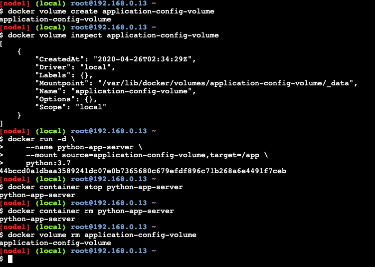

# Docker Volumens Management

## Create a Volume to a Container

Below commands creates a docker volume and associated it to a container

``` sh

docker volume create application-config-volume

docker volume inspect application-config-volume

docker run -d \
    --name python-app-server \
    --mount source=application-config-volume,target=/app \
    python:3.7

docker container stop python-app-server
docker container rm python-app-server
docker volume rm application-config-volume

```

